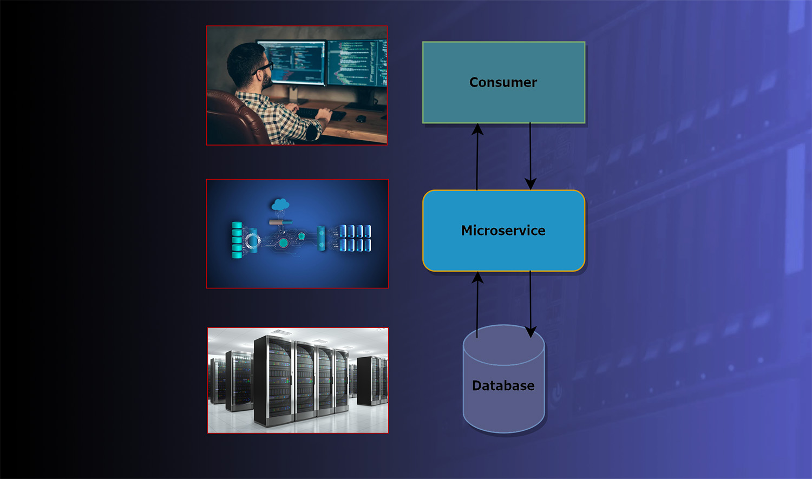
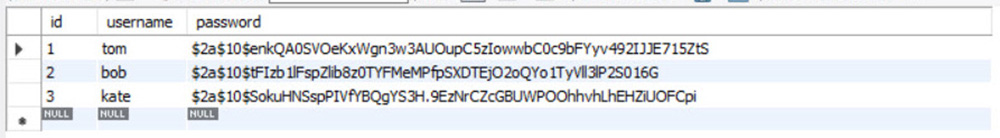
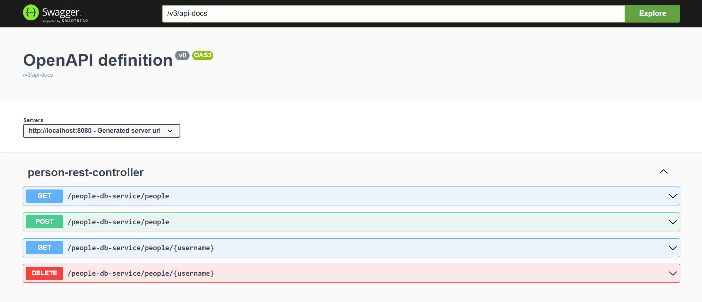
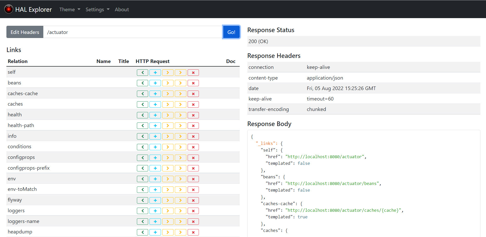
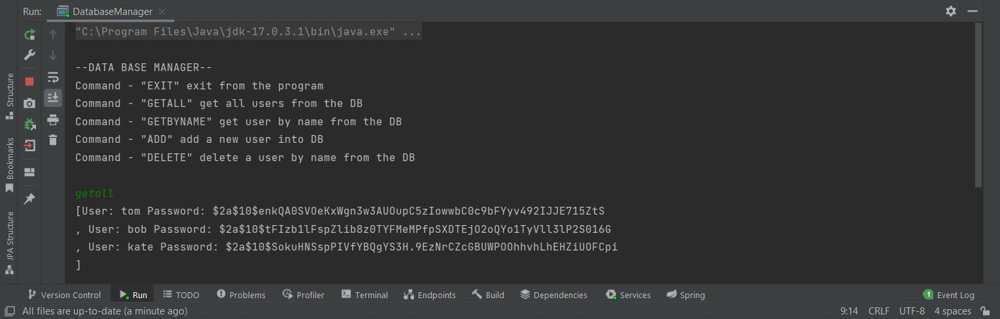

## database-microservice

### RESTful Microservice Application

***Description:***

This project contains two separate modules with different applications 
that interact with each other by exchanging data through the HTTP protocol 
according to the principle of microservice architecture. 
The "people-db-service" module directly contacts the database, 
converts the received information into JSON objects, 
and transfers them to the appropriate address so that a third-party consumer program 
can use this data for its needs. A third-party program "database-manager" 
receives data from the address bar in JSON format, converts it into the corresponding JAVA objects, 
and works with them as a typical Java application.

---

By default, the database contains three records:

Username: "tom" Password: "tom123" 
Username: "bob" Password: "bob123" 
Username: "kate" Password: "kate123" 

BCryptEncoder encrypts all passwords, and you won't be able to see them.

---

In the "people-db-service" module, the Swagger Open API definitions dependency is added,  
with the help of which the documentation for the query parameters is automatically created.  
After launching the application, you can view it at:

http://localhost:8080/swagger-ui/index.html

---

To monitor all parameters of the REST application in the "people-db-service" module, 
added dependency "actuator", which allows you to get data about the program 
in the form of a JSON representation at:

http://localhost:8080/actuator

But for the convenience of reading this data, the "hal-explorer" dependency was also added in the module, 
and now all processes can be monitored in a readable form.

http://localhost:8080 then add into "Edit Headers" field "/actuator"

---

***How to use:***

Create a new local database schema (I used MySQL) and name it "people-db-service".
In the "people-db-service" module of the project, write your DB username and password, 
in the "application.properties" configuration file, then start the service (PeopleDBService).
Afterward, go to the "database-manager" module of the project and start the "DatabaseManager" main method.
Now you can manage records in the database through the terminal, through microservice client-server interaction.

---

***Tools used:***

Java  
Maven  
Spring Framework  
Swagger Open API  
Model Mapper  
Hal Explorer  
Jackson  
MySQL  
FlyWay  
